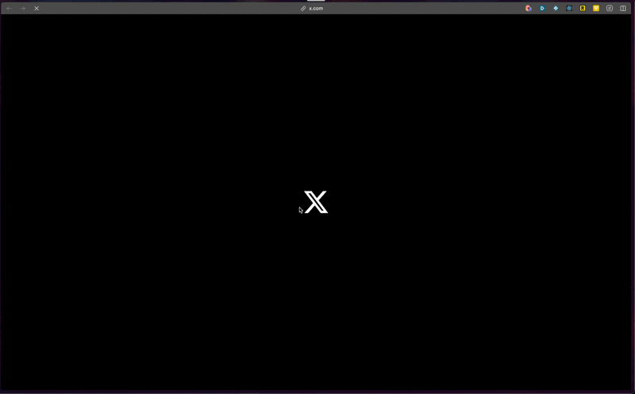

# Twitter OAuth API

A backend API in Go for Twitter OAuth authentication and token management, featuring:
- OAuth login flow with callback handling
- Access and refresh token functionality
- Optional Docker deployment

## Getting Started

### Requirements
- Go 1.22+
- Environment variables configured (e.g., via a .env file)

### Twitter OAuth Setup
1. Visit the [Twitter Developer Portal](https://developer.twitter.com/en/portal/dashboard).
2. Create or select a project, then go to "Projects & Apps" > Your Project > "Keys and tokens".
3. Under "OAuth 2.0 Client ID and Client Secret":
   - Copy the "Client ID" for `TWITTER_CLIENT_ID`
   - Generate and copy the "Client Secret" for `TWITTER_CLIENT_SECRET`
4. In "User authentication settings":
   - Enable OAuth 2.0
   - Set the callback URL to:
     ```
     http://localhost:8000/api/auth/callback
     ```
   - Select the necessary scopes (e.g., "Tweet read", "Users read") and save the changes.


### Installation
1. Clone the repository:
   ```
   git clone https://github.com/mbenaiss/twitter-oauth-api.git
   cd twitter-oauth-api
   ```
2. Install dependencies:
   ```
   go mod tidy
   ```
3. Configure the environment:
   ```
   cp .env.example .env
   ```
   Then edit the `.env` file with:
   ```
   # Server Configuration
   PORT=8000

   # OAuth Configuration
   TWITTER_CLIENT_ID=     # Your Twitter OAuth client ID
   TWITTER_CLIENT_SECRET= # Your Twitter OAuth client secret

   # API Configuration  
   API_KEY=              # Private API key for authentication
   ```

### Running the API
- **Development Mode:**
  ```
  go run main.go
  ```
- **Production Build:**
  ```
  go build -o twitter-oauth-api
  ./twitter-oauth-api
  ```

By default, the API runs at `http://localhost:8080`.

### API Endpoints

#### 1. Login Initiation
```
GET /?api_key=YOUR_API_KEY
```
Redirects to the Twitter OAuth login page.



#### 2. OAuth Callback
```
GET /callback?api_key=YOUR_API_KEY
```
Handles the OAuth callback and returns user information along with tokens.

Example Response:
```json
{
  "token": {
    "token_type": "bearer",
    "expires_in": 7200,
    "access_token": "xxx...",
    "scope": "mute.write block.read follows.read ...",
    "refresh_token": "xxx..."
  },
  "user": {
    "id": "XXX",
    "name": "XXX",
    "username": "XXX"
  }
}
```

#### 3. Token Refresh
```
POST /refresh?api_key=YOUR_API_KEY
```
Send a JSON body:
```json
{
  "refresh_token": "your_refresh_token"
}
```
Returns a new access token.

### Optional: Docker Setup
1. Build the Docker image:
   ```
   docker build -t twitter-oauth-api .
   ```
2. Run the container:
   ```
   docker run -p 8000:8000 --env-file .env twitter-oauth-api
   ```
The API will be accessible at `http://localhost:8000`.

## License
Licensed under the MIT License.